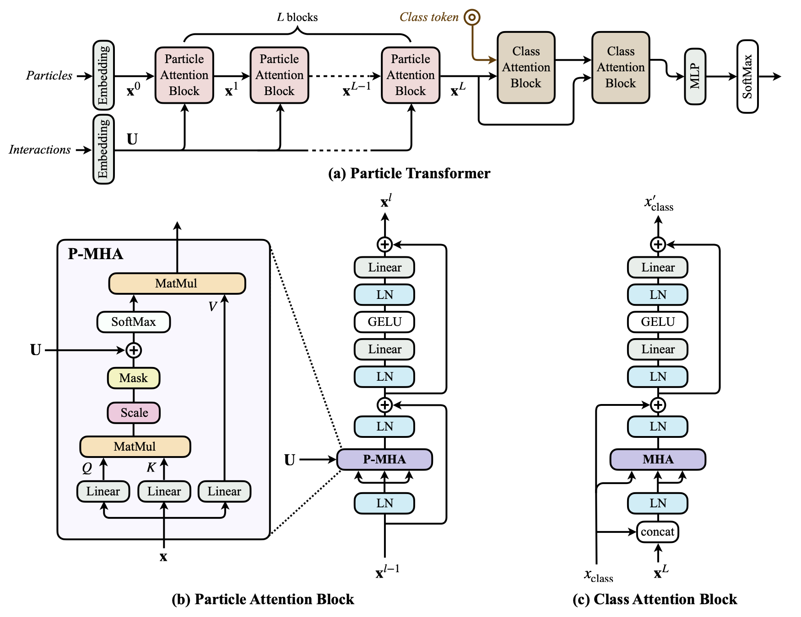
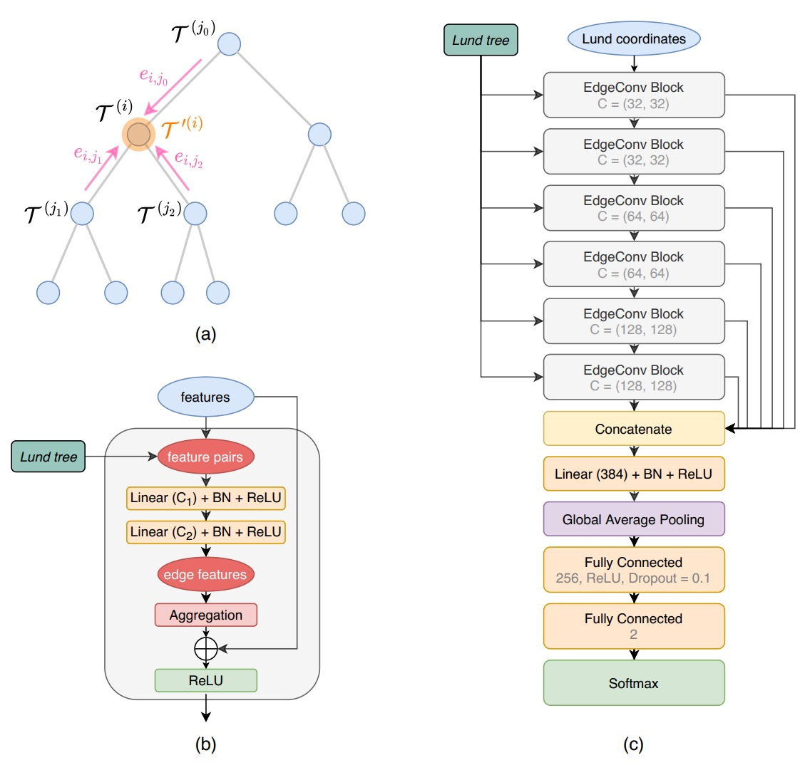
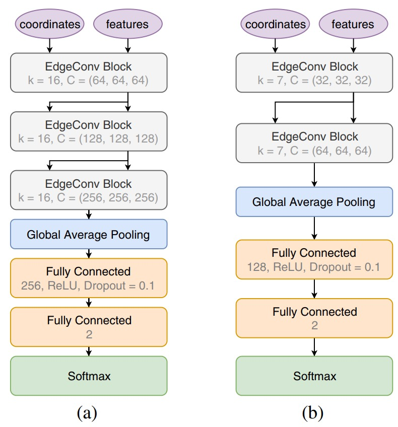
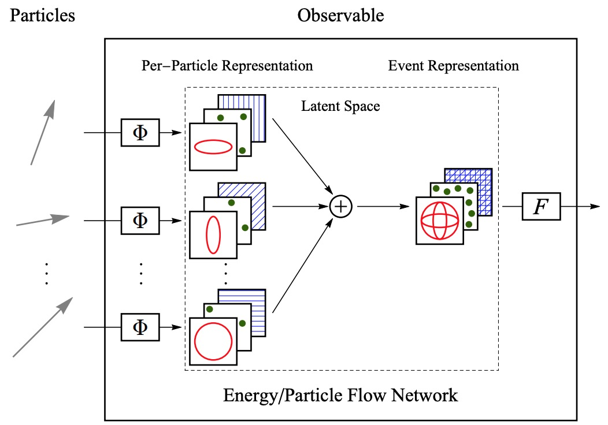
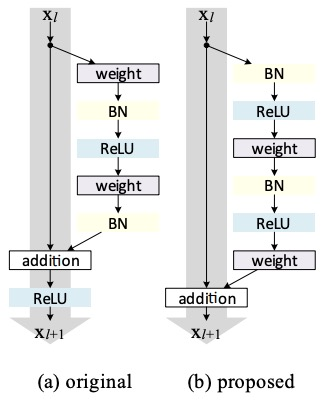
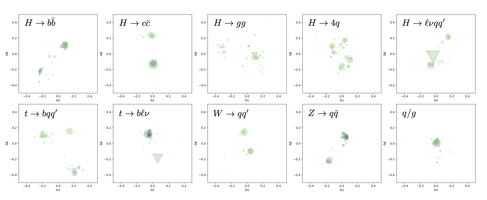
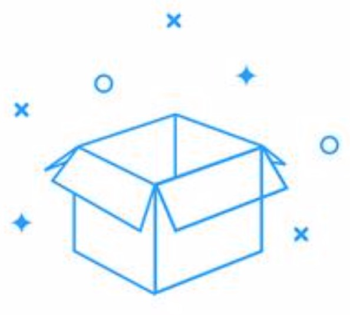
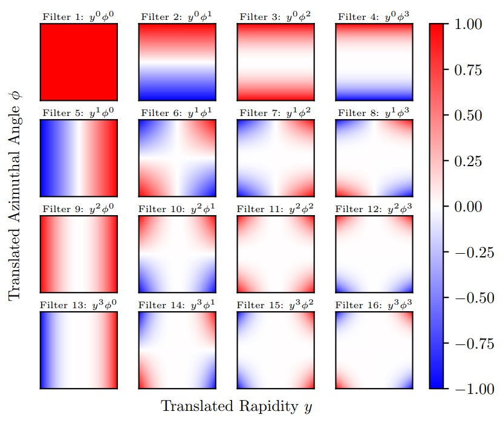

#### English | [简体中文](https://github.com/zhangzhengde0225/AI_for_Particle_Physics/blob/main/docs/README_zh_cn.md)

# AI for Particle Physics: Papers & Datasets

## Introduction

This repository is a collection of datasets and papers for AI in particle physics. The datasets are collected from the public domain and the papers are collected from the arXiv, conferences and journals. The purpose of this repository is to provide a convenient way for researchers to access the datasets and papers, and futhur provide a replication tool with a unified API.

## Overview 

### Papers

<b>Jet Tagging</b>

<table align="center">
    <tbody>
        <tr>
            <td align="center"><b>Arch</td>
            <td align="center"><b>Neural Network</td>
            <!-- <td align="center">Author</td> -->
            <td align="center"><b>Title</td>
            <td align="center"><b>Source Codes</td>
            <td align="center"><b>Is Codes avail in HAI</td>
        </tr>
        <!-- ParT -->
        <tr>
            <td align="center"> </td>
            <td align="center">2022 Particle Transformer</td>
            <!-- <td align="center">HuiLin Qu et.al.</a></td> -->
            <td align="center">
                Particle Transformer for Jet Tagging (ArXiv) 
                <a href="https://arxiv.org/abs/2202.03772"></img>
                </td>
            <td align="center">
                <a href="https://github.com/jet-universe/particle_transformer">
            <td align="center">
                <a href="https://code.ihep.ac.cn/zdzhang/hai"><b></a>
            <!-- <td align="center">JetClass</td> -->
        </tr>
        <tr>
            <td align="center"> </td>
            <td align="center">2021 LundNet</td>
            <!-- <td align="center">Frédéric A. Dreyer and  Huilin Qu -->
            <td align="center">
                Jet tagging in the Lund plane with graph networks (JHEP) 
                <a href="https://doi.org/10.1007/jhep03(2021)052"></img></td>
            <td align="center">
                
            <td align="center">
                </td>
        </tr>
        <!-- PN -->
        <tr>
            <td align="center"> </td>
            <td align="center">2020 ParticleNet</td>
            <td align="center">
                ParticleNet: Jet Tagging via Particle Clouds (PRD) <a href="https://journals.aps.org/prd/abstract/10.1103/PhysRevD.101.056019"></td>
            <td align="center">
                
            <td align="center">
                </td>
        </tr>
        <!-- PFN -->
        <tr>
            <td align="center"> </td>
            <td align="center">2018 Particle Flow Network</td>
            <td align="center">
                Energy Flow Networks: Deep Sets for Particle Jets (JHEP) <a href="https://arxiv.org/abs/1810.05165"></td>
            <td align="center">-
            <td align="center">
                </td>
        </tr>
        <!-- PCNN -->
        <tr> 
            <td align="center"> </td>
            <td align="center">2017 P-CNN</td>
            <td align="center">
                The Machine Learning Landscape of Top Taggers (SciPost Phys) <a href="https://doi.org/10.21468/SciPostPhys.7.1.014"></td>
            <td align="center">-
            <td align="center">
                </td>
        </tr>
    </tbody>
</table>

Note: HAI is the [High energy physics Artifitial Intelligence](https://code.ihep.ac.cn/zdzhang/hai) framework, which provide simple dataset download, training, evaluation, inference and deployment funciton of the benchmarks and datasets of AI4HEP algorithms.

<b>Particle Identification</b>

<b>Particle Tracking</b>

<b>Event Reconstruction</b>

<b>Other</b>

<table align="center">
    <tbody>
        <tr>
            <td align="center"><b>Arch</td>
            <td align="center"><b>Neural Network</td>
            <!-- <td align="center">Author</td> -->
            <td align="center"><b>Title</td>
            <td align="center"><b>Source Codes</td>
            <td align="center"><b>Is Codes avail in HAI</td>
        </tr>
        <tr> 
            <td align="center"> </td>
            <td align="center">2021 Ferminet</td>
            <td align="center">
                Ab initio solution of the many-electron Schrödinger equation with deep neural networks (PHYS REV RES) <a href="https://doi.org/10.1103/PhysRevResearch.2.033429"></td>
            <td align="center">
                
            <td align="center">
                </td>
        </tr>
        <tr> 
            <td align="center"> </td>
            <td align="center">2021 SPANet</td>
            <td align="center">
                Permutationless many-jet event reconstruction with symmetry preserving attention networks (PRD) <a href="https://doi.org/10.1103/PhysRevD.105.112008"></td>
            <td align="center">
                
            <td align="center">
                </td>
        </tr>
        <tr> 
            <td align="center"> </td>
            <td align="center">2014 Higgs-Susy</td>
            <td align="center">
                Searching for Exotic Particles in High-energy Physics with Deep Learning (Nature Comm.) <a href="https://doi.org/10.1038/ncomms5308"></td>
            <td align="center">
                
            <td align="center">
                </td>
        </tr>
<table>

#### TODO:
+ LAGAN
+ GaloGan
+ 2021 PointNet

### Datasets
<!-- 
 -->

<b>Jet Tagging</b>

<table align="center">
    <tbody>
        <tr>
            <td align="center"><b>Figure</td>
            <td align="center"><b>Dataset Name</td>
            <td align="center"><b>Info</td>
            <td align="center"><b>URL</td>
        </tr>
        <tr>
            <td align="center">
            <td align="center">2022 JetClass 
            <td align="left">Dataset for Jet Tagging.           <li>10 classes. <li>100M, 5M and 20M jets for training, validation and testing, respectively.
            <td align="center"><a href="https://doi.org/10.5281/zenodo.6619768">
        </tr>
        <tr>
            <td align="center">
            <td align="center">TopLandscape 
            <td align="left">Dataset for Jet Tagging
            <!--  -->
            <td align="center">
                <a href="https://hqu.web.cern.ch/datasets/TopLandscape/TopLandscape.tar">
        </tr>
        <tr>
            <td align="center">
            <td align="center">2019 QuarkGluon
            <td align="left">Dataset for Jet Tagging. 
                <li> Two datasets of quark and gluon jets. 
                <li> Generated with Pythia 8, one with all kinematically realizable quark jets and one that excludes charm and bottom quark jets.
            <td> <a href='https://doi.org/10.5281/zenodo.3164691'>
        </tr>
        <tr>
            <td align="center">
            <td align="center">Jet Images for LAGAN
            <td align="left">Jet Images for Location Aware Generative Adversarial Network
            <td align="center"><a href="https://doi.org/10.17632/4r4v785rgx.1">
        </tr>
        <tr>
            <td align="center">
            <td align="center">2017 3D Jet Images for GaloGAN
            <td align="left">Simulating 3D High Energy Particle Showers in Multi-Layer Electromagnetic Calorimeters with Generative Adversarial Networks.
            <td align="center"><a href="https://doi.org/10.17632/pvn3xc3wy5.1">
        </tr>
        <tr>
            <td align="center">
            <td align="center">2017 Electromagnetic Calorimeter Shower Images
            <td align="left">Electromagnetic Calorimeter Shower Images with Variable Incidence Angle and Position. (5.8GB)
            <td align="center"><a href="https://doi.org/10.17632/5fnxs6b557">
        </tr>
        <tr>
            <td align="center">
            <td align="center">2018 IML Challenge on Jet Mass Regression
            <td align="left">This dataset is associated with the LPCC IML (Lhc Physics Center at Cern Inter-experimental Machine Learning) working group.  It was produced for the second IML annual workshop (April 2018). (7.3GB)
            <td align="center"><a href=https://zenodo.org/record/1345492">
        </tr>
        <tr>
            <td align="center">
            <td align="center">2017 IML Challenge on Jet Classification
            <td align="left">The data sample has been generated simulating with Pythia 8 a Randal-Sundrum graviton, decaying either to a quark or to a gluon pair.
            <li> 2 classes: quark and gluon jets. </td>
            <td align="center"><a href="https://gitlab.cern.ch/IML-WG/IMLWorkshop2017-Challenge">
        </tr>
    </tbody>

</table>

#### TODO

+ MLPhysics http://mlphysics.ics.uci.edu
    + 2021 ttbar
    + Antihydrogen+
    + htautau
    + hepjets
    + HEPMASS
    + Higgs&SUSY
    + Jet Flavor
    + neutrino
    + 2020_electron
    + muon_2020
    + 2021_muon
    + 2020_SARM

+ CMS realistic data: http://opendata.cern.ch/docs/about-cms
+ 2018 particle tracking challenge in Kaggl: https://sites.google.com/site/trackmlparticle/home
+ 2015 Flavours Physics Challenge in Kaggle: https://home.web.cern.ch/news/news/computing/flavours-physics-join-lhcb-machine-learning-contest
+ 2014 Higgs Boson Challenge in Kaggle: https://www.kaggle.com/c/higgs-boson

## Contributing

We appreciate all contributions to make this repository better. Welcome to participate in this project via the following ways:

- **Star** this repository to show your interest.
- **Fork** this repository and submit a **Pull Request** to add new papers or datasets, or fix bugs. Please refer to [contributing.md](docs/contributing.md) for more details.

